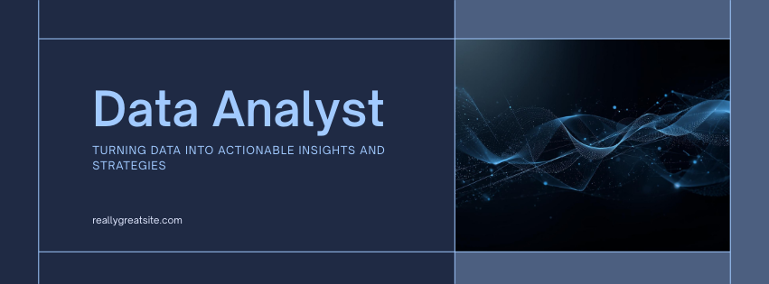

<div align="center">

<!-- Animated header -->


<!-- Typing animation -->
<a href="https://git.io/typing-svg">
  
</a>

<br/>

<!-- Badges -->
[](https://www.linkedin.com/in/tsabeh-hamed-data-analyst)
[](mailto:tsabehamed@gmail.com)
[](https://github.com/tsabeeeh)

<br/>

---

</div>

## 👋 About Me

> *"Data without context is noise. Data with insight is power."*

I'm a **Data Analyst** based in Egypt, passionate about transforming complex data into clear, actionable insights that drive real business decisions.

- 🔍 Specialized in **data cleaning, analysis, and visualization**
- 📊 Building dashboards that **support strategic decision-making**
- 🤖 Solid foundation in **Machine Learning & Deep Learning**
- 🎯 Focused on **accuracy, business context, and actionable insights — not just charts**
- 🌍 Open to **Remote & Freelance** opportunities

---

## 🛠️ Tools & Technologies

<div align="center">

### 📊 Data Analysis & BI


### 💻 Programming


### 🤖 Machine Learning


</div>

---

## 🔍 Analytical Strengths

| Strength | Description |
|----------|-------------|
| 🎯 **Problem Translation** | Convert business questions into structured data problems |
| 📈 **Pattern Recognition** | Identify trends, anomalies, and insights in complex datasets |
| ✅ **Data Quality** | Ensure data integrity before visualization or modeling |
| 📊 **Dashboard Design** | Build interactive dashboards that support strategic decisions |
| 🗣️ **Communication** | Explain technical insights clearly to non-technical stakeholders |

---

## 📂 Featured Projects

> 👉 Check my repositories below for detailed projects, datasets, and code.

---

## 📊 GitHub Stats

<div align="center">


</div>

<div align="center">

[](https://git.io/streak-stats)

</div>

---

## 🏆 What Makes Me Different

```python
tsabeh = {
    "mindset":        "Why before How — context drives analysis",
    "approach":       "Business Intelligence + Python analytics",
    "impact":         "Data insights connected to real business value",
    "growth":         "Continuous learner in analytics, ML & AI",
    "availability":   "Remote & Freelance Ready 🌍"
}
```

---

## 📬 Let's Connect

<div align="center">

[](https://www.linkedin.com/in/tsabeh-hamed-data-analyst)
[](mailto:tsabehamed@gmail.com)

</div>

<div align="center">


</div>



# Tsabeh Hamed  
### Data Analyst | Analytics & Machine Learning

📊 Excel | Power BI | SQL Server | Python  
🤖 Machine Learning | Deep Learning (Foundations)  
📍 Egypt | Remote & Freelance Ready  

---

## 👋 About Me
I am a Data Analyst with hands-on experience in data cleaning, analysis, 
and visualization to support data-driven decision making.  
I focus on accuracy, business context, and actionable insights — not just charts.  
I also have a solid foundation in Machine Learning and Deep Learning, 
using predictive models to enhance analytical outcomes.

---

## 🔍 Analytical Strengths
- Translating business questions into structured data problems  
- Identifying trends, patterns, and anomalies in complex datasets  
- Ensuring data quality before visualization or modeling  
- Building dashboards that support strategic decision-making  
- Explaining insights clearly to non-technical stakeholders  

---

## 🛠️ Tools & Technologies

### 🔹 Data Analysis & BI
- Excel (Advanced Formulas, Pivot Tables, Power Query)
- Power BI (DAX, Data Modeling, Interactive Dashboards)
- SQL Server (Joins, CTEs, Subqueries, Window Functions)

### 🔹 Programming
- Python (Pandas, NumPy, Matplotlib, Seaborn)

### 🔹 Machine Learning & Deep Learning
- Supervised & Unsupervised Learning
- Regression & Classification Models
- Feature Engineering & Model Evaluation
- Neural Networks Fundamentals
- Applying ML for decision support, not black-box predictions

---

## 📂 Featured Work
👉 Check my repositories below for detailed projects, datasets, and code.

---

## 🏆 What Makes Me Different
- Strong foundation in both Business Intelligence and Python analytics  
- Analytical mindset focused on **why** before **how**  
- Ability to connect data insights with real business impact  
- Continuous learner in analytics, ML, and AI-driven decision making  

---

## 📬 Contact
- LinkedIn :https://www.linkedin.com/in/tsabeh-hamed-data-analyst
- Email: tsabehamed@gmail.com
